[](https://codemagic.io/apps/5dda7273011bc91bb5e1e928/5dda7273011bc91bb5e1e927/latest_build)

# Flutter For Wordpress


A flutter app for a wordpress based news website (https://flutterblog.crumet.com/).

[](https://play.google.com/store/apps/details?id=com.wordpress.flutter.app)

# Installation
You need to have a wordpress website before you implement the app.

If you have wordpress website already then follow the simple steps given below to build your own **Wordpress Flutter App**.

## Edit your wordpress theme

Update the wordpress **functions.php** file on your theme by appending the following code at the end. The app will not function correctly if this step is not followed.

```php
function flutter_news_rest_prepare_post($data, $post, $request)
{
    $_data = $data->data;
    $video = get_post_meta($post->ID, 'td_post_video', true);
    if ($video) {
        $_data["custom"] = get_post_meta($post->ID, 'td_post_video', true);
    } else {
        $_data["custom"]["td_video"] = "";
    }
    $featured_image_id  = $_data['featured_media'];
    $featured_image_url = get_the_post_thumbnail_url($post->ID, "original");
    
    if ($featured_image_url) {
        $_data['custom']["featured_image"] = $featured_image_url;
    } else {
        $_data['custom']["featured_image"] = "";
    }
    
    $_data['custom']["author"]["name"]   = get_author_name($_data['author']);
    $_data['custom']["author"]["avatar"] = get_avatar_url($_data['author']);
	
	$categories = get_the_category($_data["id"]);
	$_data['custom']["categories"] = $categories;
    
    $data->data = $_data;
    
    return $data;
}

add_filter('rest_prepare_post', 'flutter_news_rest_prepare_post', 10, 3);

// Enable comment without being loggedin
function filter_rest_allow_anonymous_comments() {
    return true;
}

add_filter('rest_allow_anonymous_comments','filter_rest_allow_anonymous_comments');

```

## Edit the constants

Change the constants from the **./lib/common/constants.dart** file. For the categories name and ID refer to your wordpress website.

```dart
// Your wordpress website URL
const String WORDPRESS_URL = "https://flutterblog.crumet.com"; 

// Featured category ID (for Home Screen top section)
const int FEATURED_ID = 2;

// Tab 2 page category name
const String PAGE2_CATEGORY_NAME = "Lifestyle";

// Tab 2 page category ID
const int PAGE2_CATEGORY_ID = 6;

// Custom categories in search tab
// Array in format
// ["Category Name", "Image Link", "Category ID"]
const List<dynamic> CUSTOM_CATEGORIES = [
  ["Lifestyle", "assets/boxed/lifestyle.png", 6],
  ["Fashion", "assets/boxed/fashion.png", 12],
  ["Music", "assets/boxed/music.png", 14],
  ["Photography", "assets/boxed/photography.png", 15],
  ["Sport", "assets/boxed/sport.png", 13],
  ["World", "assets/boxed/world.png", 11],
  ["Health", "assets/boxed/health.png", 8],
  ["Travel", "assets/boxed/travel.png", 7],
  ["Recipies", "assets/boxed/recipies.png", 10],
];
```

## Push Notification (Optional)

This project uses firebase messenging for push notification.

To integrate push notification from firebase follow the steps:
- Go to firebase console
- Generate and Download **google-services.json** file
- Place **google-services.json** file inside android/app
- It should be ready now. Test your push notification.

For further instruction read documentation from https://pub.dev/packages/firebase_messaging

# Screenshots

|   |   |   |
|---|---|---|
||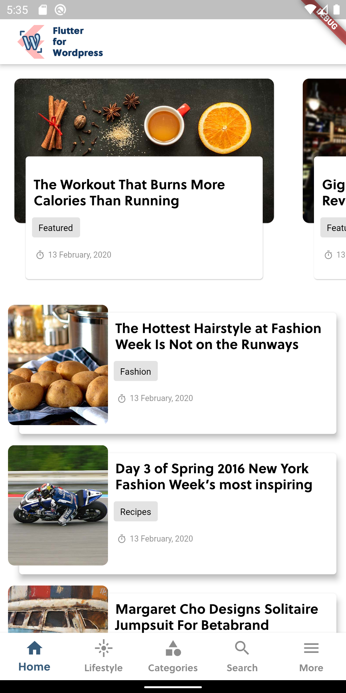|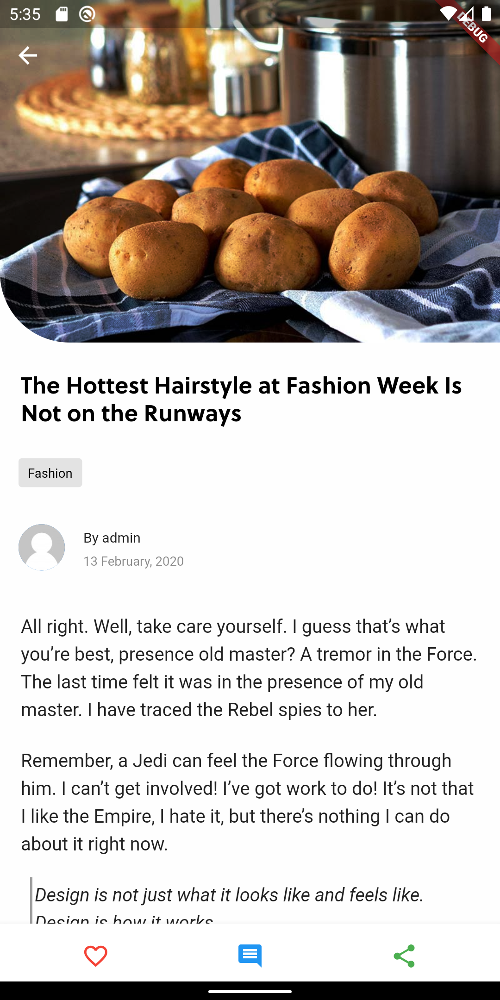|
|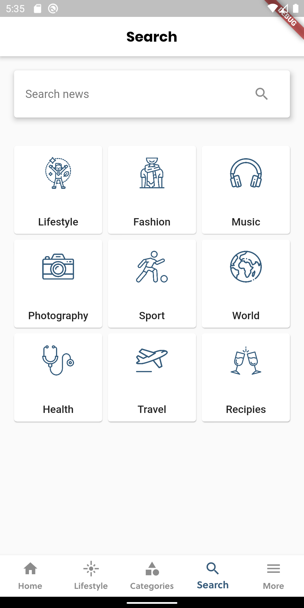|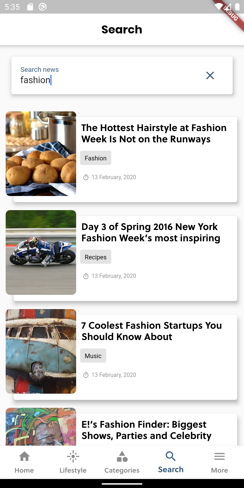|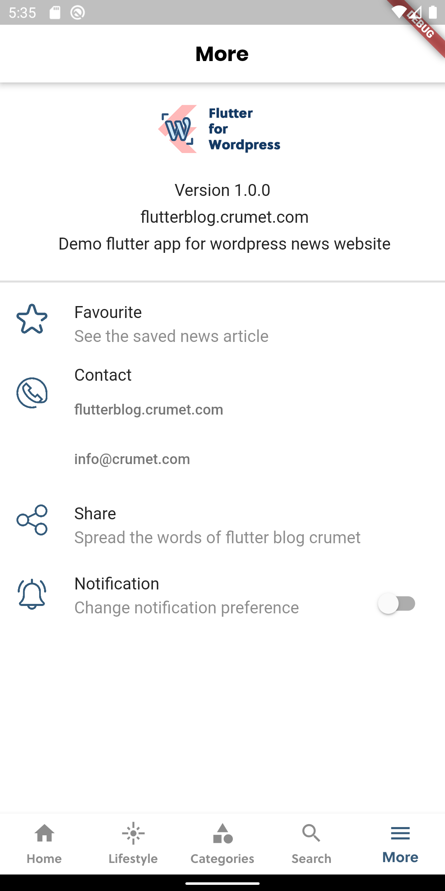|
|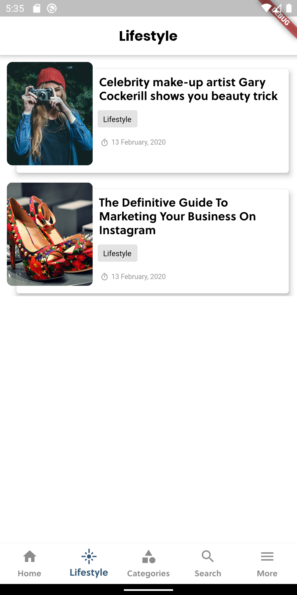|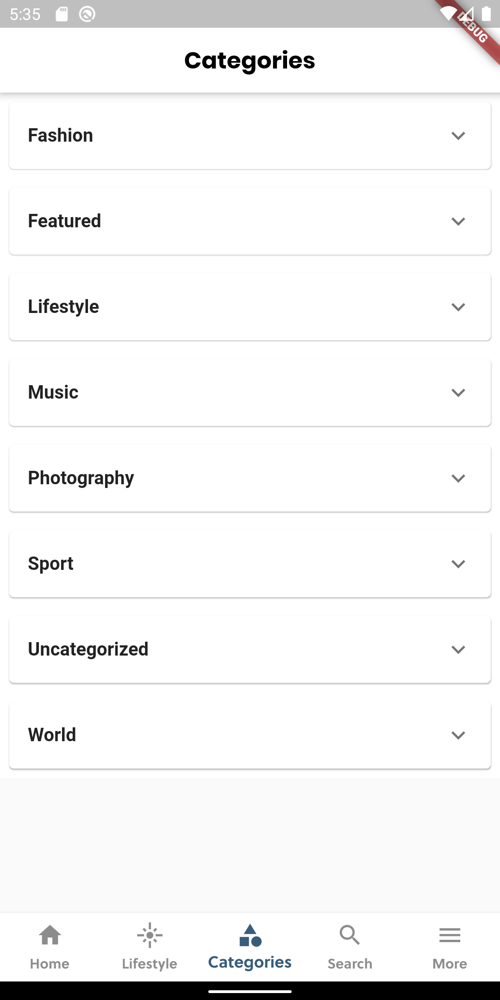|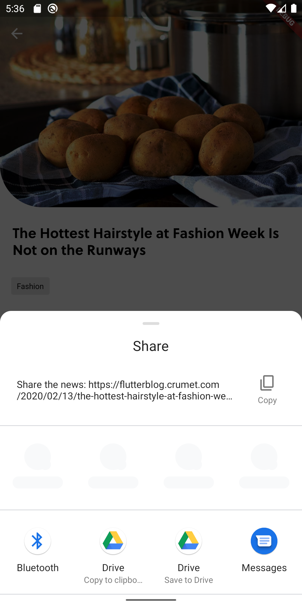|
|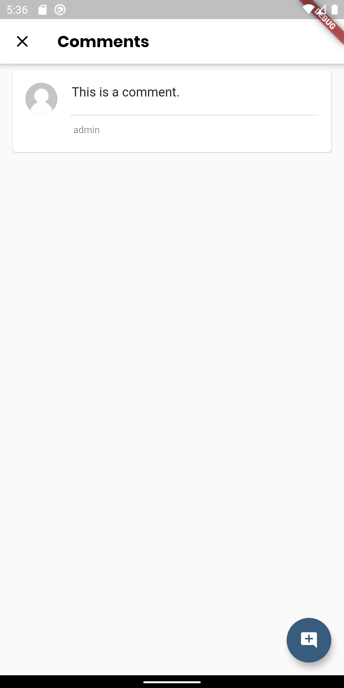|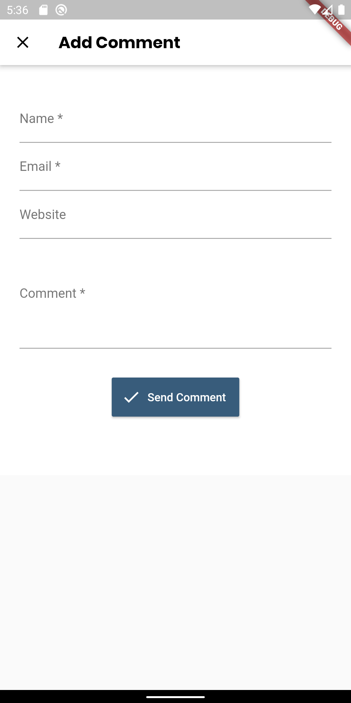|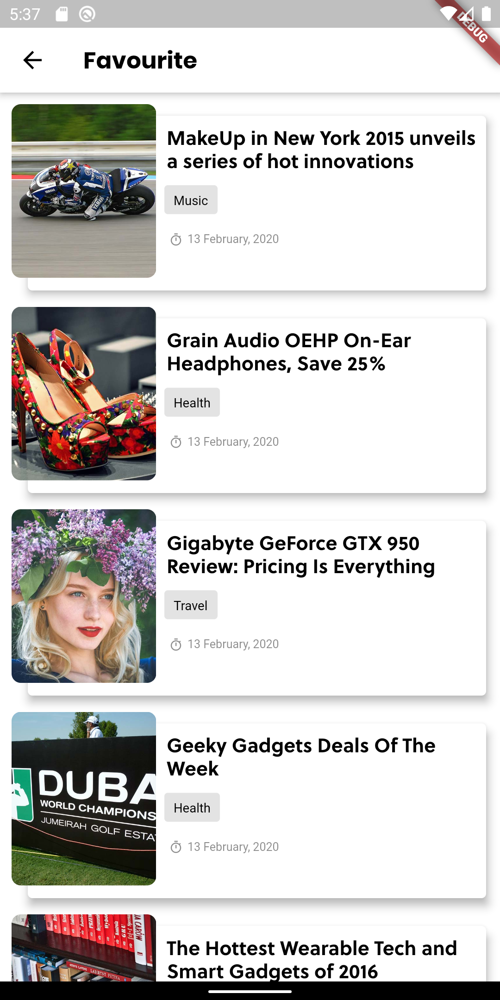|

# LICENCE

Released under the [MIT](./LICENSE) License.<br>
